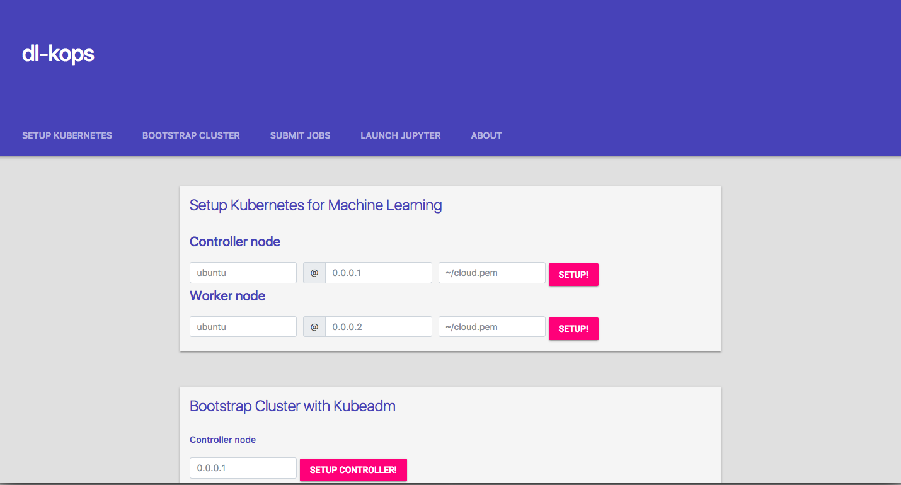

dl-kops
=======

Description
-----------

This app is to simplify machine learning on Kubernetes for beginners.

It is a work in progress. A finished version should be available in the coming weeks.

* MVP of an end-to-end deployment app for machine learning jobs on Kubernetes clusters.
* Enables single click installation of CUDA, CuDNN, Kubernetes components.
* Single click bootstrapping of clusters.
* Single click activation of alpha features to enable discovery of GPUs.
* Written in Go.

Future Work
-----------
* Prometheus, Grafana dashboard for monitoring.
* Tensorboard for visualizing training.
* Support for custom schedulers.

Setup
-----

     cd $GOPATH/src
     mkdir -p github.com/swiftdiaries
     cd github.com/swiftdiaries/
     git clone github.com/swiftdiaries/dl-kops
     cd dl-kops
     go run src/app/frontend/dashboard.go
     
     Go to http://localhost:8080/ on your browser.

Landing Page
------------
       
